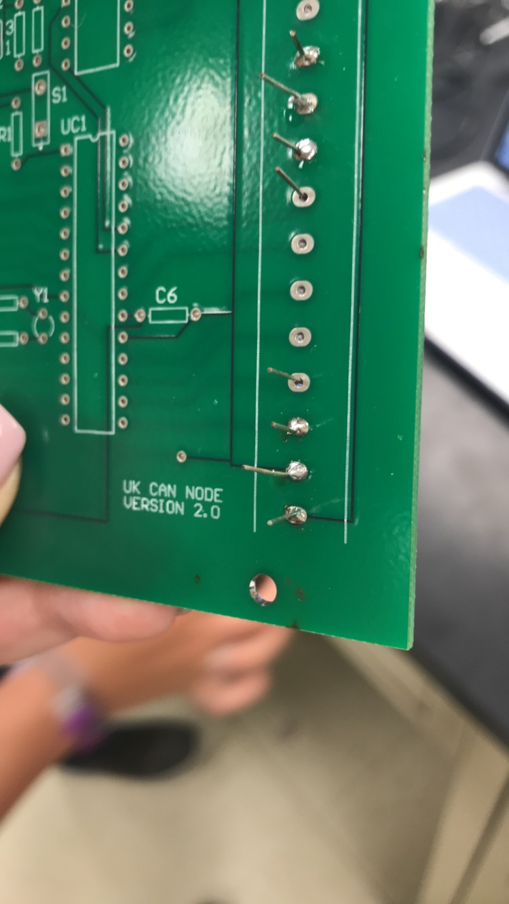
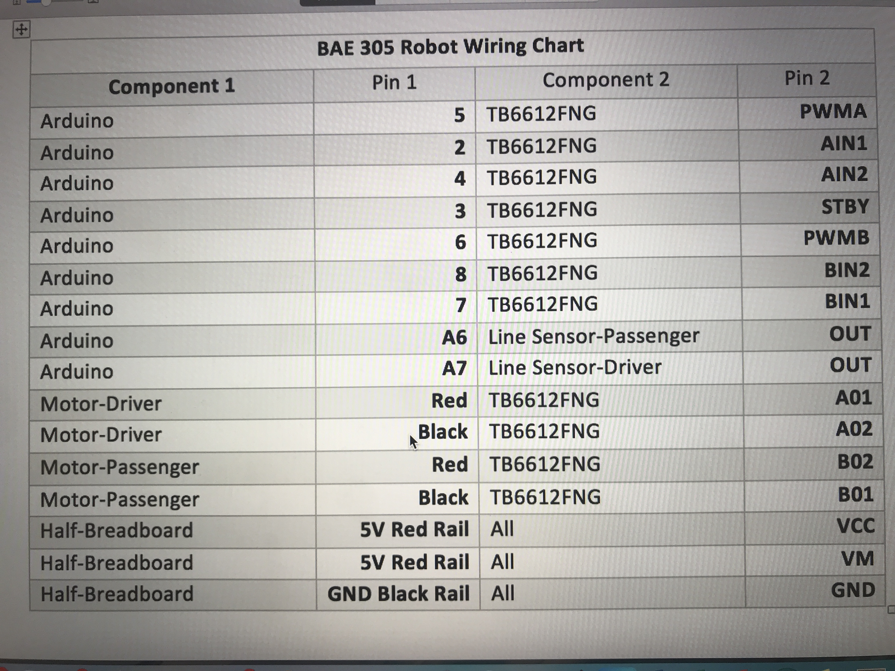

# BAE305 Lab 2 - Soldering and Reverse Engineering
# By: Spencer Givan, Ashely Bergman, Courtney Conklin
# Summary
For this lab, the overall goal is to learn the important tools of Soldering and Reverse Engineering. Soldering is a technique of sorts that "welds" or puts things together permanently. There are several way to do so and the purpose of this lab was for us to learn those ways. The lab also has us take apart a robot completely and put it back together, specifically a Redbot with shadow chassis with parts from sparkfun. This can be described as Reverse Engineering, beacuse by seeing the internal parts of the robot, its' function, design, and specificity is revealed, giving the observer the keys to how it works.
# Materials
For Soldering, the materials are as followed.
- Soldering Iron
- Stand for Soldering Iron
- Wet Paper Towel
- Power Source
- Lead to solder with

For the Robot itself,
- ROB-13259, Wheel 65mm (Rubber Tire, pair)
- ROB-13301, Shadow Chassis
- ROB-13302, Hobby Gearmotor (140 RPM, pair)
- PRT-12045, Breadboard (Mini Modular, Blue)
- PRT-12002, Breadboard (Self-Adhesive, White)
- ROB-14450, Sparkfun Motor Driver - Dual TB6612FNG (with headers)
- SEN-11769, Sparkfun Redbot Sensor - Line Follower (2 of them)
- DEV-13975, Sparkfun RedBoard - Programmed with Arduino
- Jumper Wires
- Front Motor Mount (C)
- Rear Motor Mount (D)
- Motor (K)
- Line Follower Mount (I)
- Line Follower Mount PLate (J)
- Side Strut (E)
- Nub Caster (M)
- Battery Pack Clip (H)
- Battery Holder (Z)
- 4 AA Batteries

# Assembly Procedures
Part 1 - Learning how to Solder

i. Tinning

- Watch the provided video on an introduction to soldering, and after assemble the soldering iron provided, following the given instructions.
-	Wrap the tip of the soldering iron in solder.
- Place the soldering iron on the stand so that it lays flat. Place a wet paper towel under the tip to catch any solder that falls from the tip. 
- Then, turn on the iron and wait for it to heat up. 
- Once the soldering iron is hot the solder will begin to melt. Once it has all melted and fallen off, inspect the tip of the soldering iron to ensure it has been properly tinned. A properly tinned soldering iron will have a shiny silver coating. 

ii. Soldering

- Now, Practice soldering the scrap wires into the protoboards provided. Use resistors and capacitors.
- Solder one wire or component into adjacent holes in the circuit board.
- Solder another wire or component in the two holes directly above or below the previous wire or component.
- Solder three components/wires side by side in a row. For a total of six solder joints. Verify the solder joints are correct.
- Solder the header pins onto the stick power supply. Verify that the solders were correct.

Part 2 - Build the Robot

i. 	Begin assembling the robot as specified in the following steps:
  
  a. Motors and Wheels
  - Attach the Rear Motor Mounts: Hold the wires near the middle of the Motor (K), and carefully slide a Rear Motor Mount (D) in from the side and over the two motor wires. Be careful not to snag the wires, the cable tie, or the clear plastic strap.
  -  Holding the motor wires, gently twist the Rear Motor Mount counter clockwise so that it snaps in place on the motor and the wires are centered in the gap of the motor mount. Again, be sure not to snag the wires under the motor mount.
  - Repeat the process for the second motor.
  - Attach the Front Notor Mounts: Slide a Front Motor Mount (C) onto the protruding eyelet on the front of a Motor (K). Ensure the rounded sides of the motor mounts are facing the same way.
  - Repeat the process for the second motor.
  - Attach the Motor Assemblies to the Chassis: Snap one of the motor assemblies into the left 2 horizontal slots of the Bottom Chassis Plate (A). Make sure that the rounded edges of the motor mounts and the wires are facing toward the center of the chassis.
  - Snap the other motor assembly into the right 2 horizontal slots of the Bottom Chassis Plate (A). Again, make sure that the rounded edges of the motor mounts and the wires are facing the center of the chassis.
  - Attach the Wheels: Slide one Wheel (L) onto the plastic shaft of a Motor (K). Look at the motor shaft. Notice it has two flat edges. Make sure to line up the flat edges of the motor shaft with the flat edges of the wheel. Repeat with the other wheel.
 
  b. Line Follower
  - Construct the Line Follower Assembly: Attach the 3 Line Follower Boards (Q) to the Line Follower Mount (I) such that the rectangular pegs in the Line Follower Mount poke through the mounting holes in the Line Follower Boards. Make sure the sensors are facing away/down from the clip of the mount.
  - Place the Line Follower Mount Plate (J) on top of the Line Follower Mount (I) so that the center clip of the mount is poking through the center slot of the plate.
  - You will need to connect a 3-Wire Jumper Cable (Y) to each of the Line Follower Boards (Q). Note the color of the wire attached to each pin. Black to GND, Red to VCC, and White to Out. Attach these to the follower boards.
  - Attach the Line Follower to the Chassis: Locate the wide, rectangular slot near the front of the chassis and snap the line follower assembly in from the bottom side of the chassis. Route the cables through the large hole in the bottom plate.
  
  c. Chassis - Install the battery pack on the bottom before the installing the top plate.
    Instal 4 AA batteries into the battery pack and attach to the bottom plate. Secure its' position with the battery clip (H).  
  
  - Snap the Nub Caster (M) into the slot on the back of the Bottom Chassis Plate assembly. Make sure the Nub Caster is on the side opposite the motors (the bottom side).
  - Snap the four Side Struts (E) into the diagonal slots on the four corners of the Bottom Chassis Plate assembly.
  - Route the Cables
    Position the Top Chassis Plate over the Bottom Chassis Plate – but do not snap the two plates together yet. Make sure that the front     sides of each plate line up.

    Route the wires and cables through the left and right oval slots in the Top Chassis Plate assembly as shown. For the center line         follower sensor, route this cable through the right oval slot. Note that SIK-only cables are listed with an asterisk (*).
  
     Cable Connection	Oval Side
     Left Bumper Sensor*	Left
     Right Bumper Sensor*	Right
     Left Line Follower	Left
     Center Line Follower	Right
     Right Line Follower	Right
     Left Motor wires (red and black)	Left
     Right Motor wires (red and black)	Right
     Left Wheel Encoder*	Left
     Right Wheel Encoder*	Right
   
  Now, we need to attach the Top Chassis Plate Assembly
  Line up the Top Chassis Plate on top of all the struts, and carefully snap the Top Chassis Plate assembly onto the side struts and       motor mounts. Press gently above each side strut individually until they each snap into place. If you have the Bumpers installed,       make sure the boards are between the top and bottom plates.

# Test Equipment
The only test equipment that was used in our lab was a black line of tape as well as the arduino program that was used to test the robot sensors that follow the black line of tape for movement. Also an arduino and a computer to run the program.

# Test Procedures
1. Took the built robot and plugged it into the TA's computer.
2. Ran Arduino on the computer to make sure the robot functioned properly.
# Test Results

# Discussion
Practicing soldering on the scrap materials allowed for me to become comfortable and familiar with this technique and be apply to solder the parts on my robot. I also was able to easily assemble my robot by following the directions. Another tool that I was able learn within this lab was how to read a wiring chart to connect the two components, which was something I had not be exposed to before this lab. Having a properly assembled robot that works with the Aruduino will allow me to be able to complete other labs in the future for this course.
